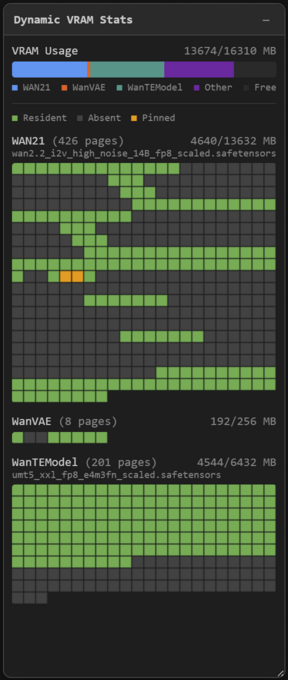

# ComfyUI-dynamicvramstats

A ComfyUI plugin that visualizes dynamic VRAM page residency in real-time.



## Features

- **VRAM usage bar**: Stacked horizontal bar showing per-model VRAM usage, other usage, and free VRAM
- **Page grids**: 2D grid of VRAM pages for each loaded model, color-coded by status:
  - **Resident** (green): page is currently loaded in VRAM
  - **Absent** (dark gray): page is not in VRAM, will be loaded on demand
  - **Pinned** (orange): page is in VRAM and locked for active use
- **Draggable and resizable** panel with collapse toggle
- **Auto-detection**: plugin disables itself if required aimdo functions are not available
- Configurable poll interval via ComfyUI settings (default: 1 second)

## Requirements

Available only on Windows and Linux with NVIDIA CUDA GPUs.

Requires [comfy-aimdo](https://github.com/Comfy-Org/comfy-aimdo) with per-page residency introspection API (merged to master in [`39016c9`](https://github.com/Comfy-Org/comfy-aimdo/commit/39016c98ff26c910c280244277058ccf00f9ed2d)). This version is not yet released with ComfyUI.

## Installation

Clone this repository into your ComfyUI `custom_nodes` directory:

```bash
cd ComfyUI/custom_nodes
git clone https://github.com/metehan/ComfyUI-dynamicvramstats.git
```

Restart ComfyUI. The panel will appear in the bottom-right corner when dynamic VRAM is active.

## Known Issues

- **Missing filenames for some model types**: The source filename is only available for diffusion models and CLIP models. VAE and some other model types don't store their filename on the model patcher object, so they are displayed by class name only. This is a ComfyUI core limitation.

## License

This project is licensed under the [GNU General Public License v3.0](LICENSE).
